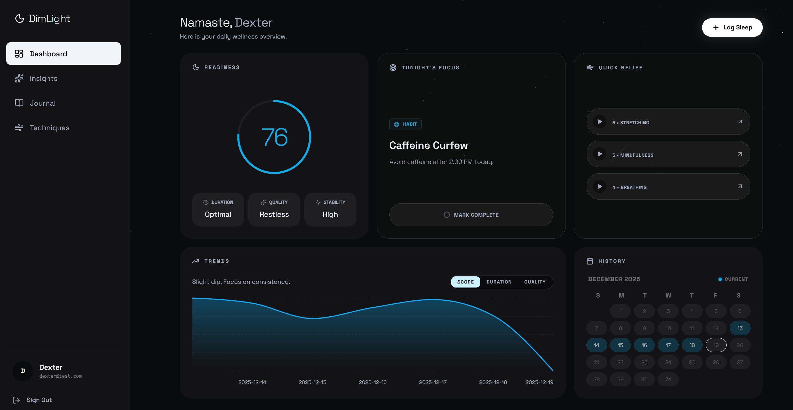
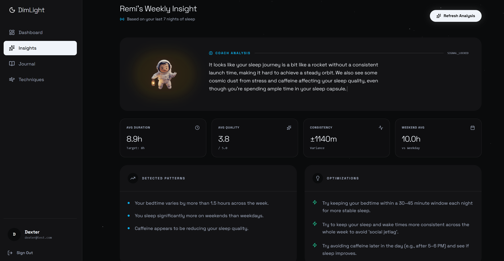
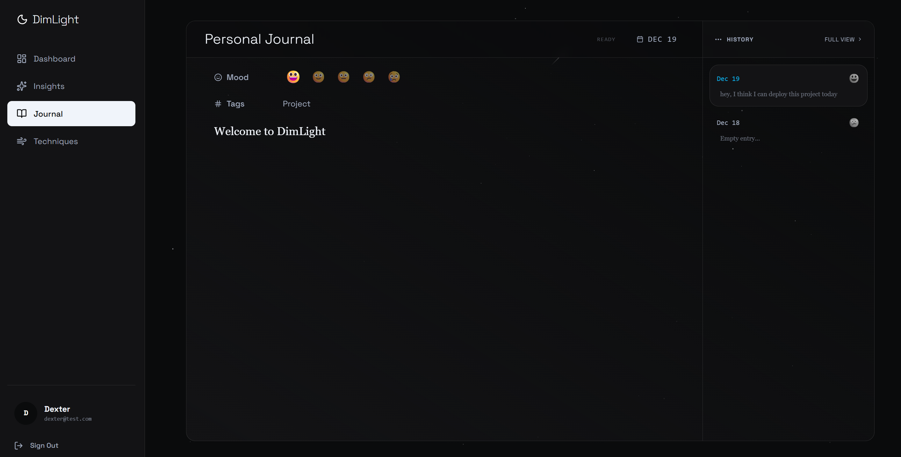

# DimLight

A modern sleep wellness tracker with AI insights, journaling, and technique coaching. Built with React (Vite) + Tailwind on the frontend and Node.js + Express + MongoDB on the backend. Deployed to Vercel (frontend) and Render (backend).

## Features
- Sleep logging: duration, quality, mood, tags, notes
- Calendar + trends: weekly stats and patterns
- AI Coach: weekly analysis and recommendations
- Journal: write, tag, and browse a gallery of entries
- Techniques library: guided breathing/relaxation sequences
- Auth: signup/login, password reset via email
- Theme + UX polish: tokens, animations, z-index layering, toasts

## Tech Stack
- Frontend: React (Vite), Tailwind, Framer Motion, React Router, react-hot-toast
- Backend: Node.js, Express, MongoDB Atlas, JWT
- Deployment: Vercel (frontend), Render (backend)

## Monorepo Structure
```
DimLight/
  dimlight-backend/
    server.js
    package.json
    config/
    controllers/
    middleware/
    models/
    routes/
    seed/
    utils/
  dimlight-frontend/
    src/
    package.json
    vite.config.js
    tailwind.config.js
    index.html
```

## Quick Start (Local)
### Prerequisites
- Node.js v18+
- MongoDB Atlas account (free tier)

### Backend
1. Create `dimlight-backend/.env` with:
   ```env
   PORT=5000
   NODE_ENV=development
   MONGO_URI=mongodb+srv://<user>:<pass>@<cluster>/dimlight?retryWrites=true&w=majority
   JWT_SECRET=change_this_secret
   FRONTEND_URL=http://localhost:5173
   SMTP_HOST=smtp.gmail.com
   SMTP_PORT=465
   SMTP_EMAIL=your_email@gmail.com
   SMTP_PASSWORD=your_gmail_app_password
   FROM_EMAIL=your_email@gmail.com
   FROM_NAME=DimLight
   CORS_ORIGINS=http://localhost:5173
   ALLOW_SEED=false
   ```
2. Install & run:
   ```powershell
   cd dimlight-backend
   npm install
   npm run dev
   ```
3. Health check:
   ```powershell
   curl http://localhost:5000/health
   ```

### Frontend
1. Create `dimlight-frontend/.env` with:
   ```env
   VITE_API_URL=http://localhost:5000
   ```
2. Install & run:
   ```powershell
   cd dimlight-frontend
   npm install
   npm run dev
   ```
3. Open: http://localhost:5173

## Environment Variables
### Backend (Render)
- `MONGO_URI`: Atlas connection string
- `JWT_SECRET`: strong random secret
- `NODE_ENV`: `production`
- `PORT`: Render sets automatically; safe to keep your value
- `FRONTEND_URL`: your Vercel URL (e.g., https://dimlight-xxxx.vercel.app)
- `SMTP_HOST`: `smtp.gmail.com`
- `SMTP_PORT`: `465` (SSL/TLS)
- `SMTP_EMAIL`: sender address
- `SMTP_PASSWORD`: Gmail App Password (not account password)
- `FROM_EMAIL`: sender address (same as above)
- `FROM_NAME`: `DimLight`
- `GEMINI_API_KEY`: your Gemini key (if AI is enabled)
- `GOOGLE_CLIENT_ID` / `GOOGLE_CLIENT_SECRET` / `GOOGLE_CALLBACK_URL`: OAuth settings
- `CORS_ORIGINS`: comma-separated allowed origins (e.g., your Vercel domain)
- `ALLOW_SEED`: `false` in prod

### Frontend (Vercel)
- `VITE_API_URL`: backend root URL (no `/api`), e.g., `https://dimlight-backend.onrender.com`

## Deploy
### Backend (Render)
- Service root: `dimlight-backend`
- Start: `npm start`
- Add env vars as above

### Frontend (Vercel)
- Root directory: `dimlight-frontend`
- Build: `npm run build`
- Output: `dist`
- Env: `VITE_API_URL=https://<your-backend>.onrender.com`

## API Overview
- `POST /auth/signup` – create account
- `POST /auth/login` – login
- `POST /auth/forgot-password` – send reset email
- `PUT /auth/reset-password/:resettoken` – reset password
- `GET /sleep/logs` – list logs
- `POST /sleep/log` – create log
- `PATCH /sleep/log/:id` – update log
- `DELETE /sleep/log/:id` – delete log
- `GET /insights/weekly` – weekly stats
- `GET /ai/weekly-coach` – AI analysis (rate-limited)
- `GET /techniques` – list techniques
- `GET /techniques/:id` – technique detail
- `GET /trends/...` – trend endpoints

## Screenshots
Add your screenshots to `docs/screenshots/` and update paths below:

- Dashboard
  
  

- Insights (AI Coach)
  
  

- Diary
  
  

## Troubleshooting
- 404 on signup: ensure frontend `VITE_API_URL` points to backend root and the request hits `/auth/signup`.
- CORS blocked: set `CORS_ORIGINS` to your Vercel domain; backend logs will show CORS errors.
- SMTP timeout: use `SMTP_PORT=465` with `secure: true`; provide a Gmail App Password.
- Rate limit warning (X-Forwarded-For): backend sets `app.set('trust proxy', 1)`; ensure it’s deployed.
- AI request limits: weekly coach route is rate-limited; cached insights mitigate tab switching.

## Notes
- Seed endpoints are disabled in production (`ALLOW_SEED=false`).
- Health endpoint: `GET /health` returns status and uptime.
- Password policy: 8+ chars including upper, lower, digit, and symbol.

## Contributing
PRs are welcome. Please open an issue to discuss major changes.
